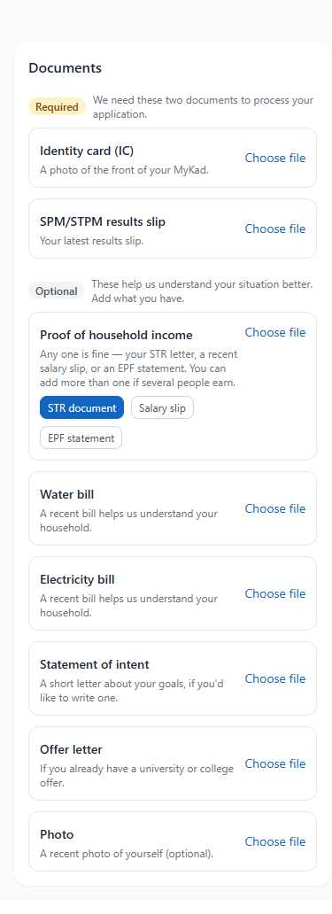
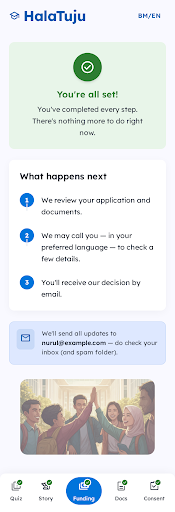

<!--
Student onboarding deck — 7 slides — for the cohort that already applied via
Google Form. English only, warm and plain. Each '---' is a slide break.
Present from any Markdown viewer (VSCode preview, Marp, or convert to PDF/PPTX
later). The deck walks the three pages in order:
/scholarship → /apply → /scholarship/application.

NOTE: this deck deliberately deviates from the live i18n on three points until
the live copy is updated to match:
  - we do NOT name MyNadi Foundation as a partner (no formal arrangement yet);
  - step 7 says "we arrange and administer the assistance" (live: "MyNadi
    Foundation arranges the assistance and administers the funds");
  - cadence is "each semester" (live: "each quarter").
The deck is the source of truth for what students hear in this session; align
the live site to match in a follow-up.
-->

# B40 Education Assistance — a community pilot
### Continuing your studies at Malaysia's public colleges and universities

*A small, community-supported effort helping students from low-income households continue at Malaysia's public colleges and universities — backed by fellow Malaysians who want to see them succeed. There's no big organisation behind this yet; it's a pilot, run by people who care.*

**About HalaTuju.** HalaTuju is a Malaysian education-pathway platform that helps SPM/STPM students find courses they qualify for. This assistance programme runs on HalaTuju — you'll create or log in to your HalaTuju account to apply.

**About this session.** You already raised your hand on our Google form (thank you). The Google form told us **who you are**; today we'll walk through the **formal application** that gives us the verifiable detail and consent we need before we can introduce you to a sponsor. Everything you share stays **confidential** — we never pass it on without your permission.

---

## The /scholarship page — your 8-step journey

*Rolling basis — no fixed deadline.*

| # | What happens | When |
|---|---|---|
| 1 | **Apply** — Sign in with Google, confirm your HalaTuju profile, submit. | About 5–10 minutes |
| 2 | **We confirm** — An email acknowledging your application. | Same day |
| 3 | **Shortlisting** — We check your results and household income against the criteria and let you know. | Within 48 hours |
| 4 | **Complete your profile** — If shortlisted, share a few more details + upload documents (IC, results slip, proof of income). | A few minutes when you're ready |
| 5 | **A short interview** — Brief phone call (~20 min) in your preferred language. To get to know you, not to test you. | After your profile is complete |
| 6 | **Ready for sponsors** — With your written consent, we prepare a confidential profile. | After the interview |
| 7 | **Matched and awarded** — Once a sponsor chooses to support you, we arrange the assistance and administer the funds together. | Up to ~2 months from application |
| 8 | **Staying supported** — Each **semester**, upload your latest results + a brief progress note. Support continues as long as you're progressing. | Throughout your studies |

---

## Can I apply?

You're eligible if **all** of these are true:

1. **Malaysian citizen** who has just completed, or is completing, **SPM or STPM**.
2. **Low-income household** — combined monthly income at or below **RM5,860** (the national B40 threshold, DOSM 2024).
3. **Solid academic record** — at least **5 A's in SPM**, or a **PNGK of 3.0 or above** in STPM.
4. **Continuing at a Malaysian public institution** — Matrikulasi, Foundation/Asasi, STPM, IPTA, polytechnic or ILKA.
5. **Reachable for a short interview** — usually a 20-minute phone call in **English, Bahasa Malaysia, or Tamil**.
6. **Willing to share progress** — **semester results** + a brief update so support can continue.

> **Close, but not exactly?** Apply anyway. Our bar is a little more generous than the headline — especially on grades. Applying lets us assess your eligibility; it doesn't guarantee assistance.

---

## Step 1 — `halatuju.xyz/scholarship/apply`

*The formal application form — 5 short sections, save as you go.*

| Section | What it asks |
|---|---|
| **About Me** | Name, NRIC (one-time, pre-filled at sign-in), contact, school, preferred call language |
| **My Family** | Household income, household size, who supports the family, STR/JKM if applicable |
| **My Results** | Your SPM / STPM grades (re-uses what you've already entered on HalaTuju) |
| **My Plans** | What you intend to study, where, and how confident you are (it's fine to be still deciding) |
| **Support** | Other scholarships you're pursuing, anything else you'd like us to know, consent to contact |

**Before submit:** a short **truthfulness declaration** — type your full name as signature. We use it to confirm you understand the commitment.

> ⚠️ **Truthfulness matters.** We later verify what you say against your documents (MyKad, results slip, income proof) and at the interview. **Mismatches will likely disqualify your application.** If you're unsure of an exact number — your household's monthly income, for example — be honest about your uncertainty in the open notes rather than guessing. We can work with *"I'm not sure"*; we can't work with information that doesn't match.

**After submit (Steps 2 → 3):** a same-day acknowledgement email arrives; within 48 hours you'll hear whether you've been **shortlisted** (an email with the next link) or **not this round** (a warm note explaining why; you can re-apply when circumstances change). All comms go to the email you applied with — **please check your spam folder**.

> [insert live screenshot of `/scholarship/apply` desktop view here]

---

## Step 4 — `halatuju.xyz/scholarship/application`

*If shortlisted, you'll be invited here. Five small tabs — no fixed time limit.*

| Tab | What it asks |
|---|---|
| **1. Quiz** | The HalaTuju course-fit quiz (re-uses your previous answers). |
| **2. Your story** | About your family + about you. Mostly optional. Write in **BM, English, or Tamil**. |
| **3. Funding** | Tick the categories support would help with — *living, transport, accommodation, books, device*. Plus a short note. Assistance is **up to RM3,000** (could be less, depending on funds and need). |
| **4. Documents** | **Required**: IC + results slip. **Optional**: one income proof (STR / salary slip / EPF), utility bills, statement of intent, offer letter, photo. When you upload your IC we'll **automatically check it against your details** to help spot typos — your photo isn't kept at Google. |
| **5. Consent** | Your formal permission to share your confidential profile with potential sponsors. You can withdraw it at any time. |

> 💡 **Tell us as much as you can.** *Your story* and the funding note are your chance to put a person behind the numbers — **the more we know, the better we can advocate for you to sponsors.** Write in your own words, in the language you're most comfortable in. Don't worry about being polished — clarity beats polish every time. And the same truthfulness rule applies: honest uncertainty is fine; **mismatches will likely disqualify**.

When all five tabs are done you'll see:

> ✅ **"You're all set!"** — *You've completed every step. There's nothing more to do right now.* Then a short *"What happens next"* panel (we review → we may call you → decision by email).

> 
> 

---

## After your profile is complete — Steps 5 to 8

**Step 5 — The phone call** *(~20 minutes, your preferred language).* A warm conversation. We ask about your story, your plans, what worries you, what would help. No trick questions; nothing is graded. *(We may also cross-check a few things — please be straightforward about anything you weren't sure of in writing.)*

**Step 6 — Profile prepared for sponsors.** We draft a short, confidential profile based only on what **you** told us. A coordinator reviews it before any sponsor sees it.

**Step 7 — Matched and awarded.** Once a sponsor chooses to support you, we arrange the assistance and administer the funds together with you. From application to award typically takes **up to two months**.

**Step 8 — Staying supported, each semester.** Each semester you upload your latest results + a short progress note. As long as you're progressing, support continues through your studies.

**A few important things, plainly:**
- 🆓 **No fee, ever.** Free to apply, free to be in.
- 🔒 **Confidential.** Your information goes only to our small coordinator team and (with your written consent) to potential sponsors.
- ✋ **Soft signals, not hard blocks.** The IC auto-check is just a hint — a human always reviews your documents before any decision.
- ⚠️ **Truthfulness disqualifies.** Mismatches between what you say and what your documents show will likely end your application. Be honest about uncertainty.
- 👨‍👩‍👧 **Under 18?** A parent/guardian co-signs the consent. We'll guide you through it.
- 🇲🇾 **Public institutions only**, this round — Matrikulasi, Foundation/Asasi, STPM, IPTA, polytechnic, ILKA.

---

## Questions?

- 📨 Email us at the address on **halatuju.xyz/scholarship** — we reply within 2 working days.
- 📞 The interview is a great time to ask anything you weren't sure about.
- 🤝 We're a small group of Malaysians helping fellow Malaysians. Not lenders — a community pilot. **Welcome.**

---

<!--
PRESENTER NOTES:

- This deck deliberately deviates from the live /scholarship i18n on three
  points (MyNadi mentions removed from step 7 + about.body; quarterly → semester).
  Update the live i18n in a follow-up to match what students hear here.
- Step copy on slide 2 is otherwise verbatim from the live `scholarship.landing.how`
  i18n keys (en.json). If you change website copy, change this deck too.
- Suggested live screenshots to capture and drop in:
  - Slide 4: /scholarship/apply on desktop, About Me section visible
  - Slide 5 (optional): the live /scholarship/application 5-tab shell, an early tab
- Run time: 7–8 minutes if presenting briskly, with 5 minutes Q&A.
- For non-technical students: do NOT show file paths (`/scholarship/application`)
  on the screen during the talk; just say "the next page".
- For mixed audience (students + parents): emphasise the "important things,
  plainly" bullets on slide 6 (no fee, confidentiality, truthfulness, under-18
  guardian step).
- Truthfulness is the strongest reminder we lean on — it appears on slide 4,
  slide 5, and the closing bullets on slide 6. Don't soften it.
-->
